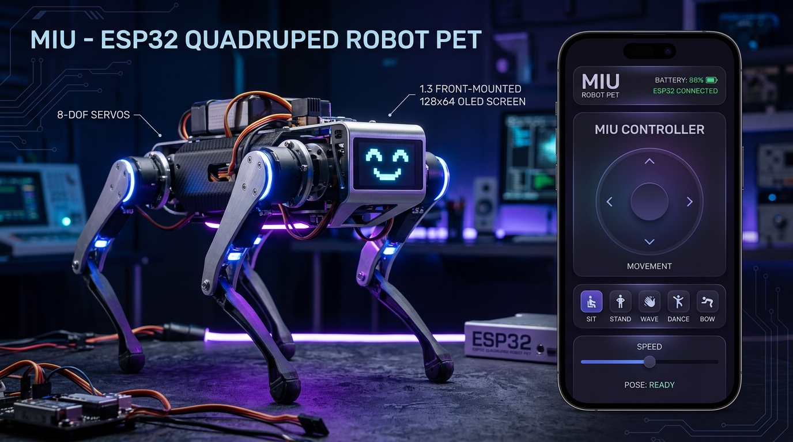

# Miu Robot — ESP32 Quadruped Firmware & Web Controller 🤖🐾


<p align="center">
  
</p>

Customized embedded firmware and web controller for the **Miu** 8-DOF quadruped robot pet. 

> [!NOTE]
> This project is a customized fork and hardware enhancement of the open-source [**Sesame Robot**](https://github.com/dorianborian/sesame-robot) created by [Dorian Borian](https://github.com/dorianborian).

---

## 🌟 Miu Enhancements over Upstream

- **Hardware Pinout Flexibility**: Added full support for **LOLIN S2 Mini (ESP32-S2)** alongside Sesame Distro Boards V1, V2, and V3.
- **TTP223 / Capacitive Head Touch Sensor (`GPIO 12`)**: Detects physical head petting to trigger happy emotes, purring sound effects, and camera shutter events on connected mobile apps.
- **Enhanced OLED Animation Engine**: Expressive multi-frame pixel art face bitmaps with talking lip-sync variants.
- **Captive Portal & Web Controller**: Modern glassmorphism UI served directly over Wi-Fi Access Point (`miu-controller`) or Station mode.
- **Extended Pose Library**: Added custom poses and emotes (wave, dance, point, bow, cute, freaky, worm, shake, shrug, dead, crab, knead).
- **Expanded HTTP REST API**: Fast endpoints for direct control from Android (`miu-phone`), Desktop (`miu-desktop`), and Wear OS (`miu-watch`).

---

## 🔌 Hardware & Pinout

### Recommended Pinout (LOLIN S2 Mini)

| Component | ESP32-S2 Pin | Notes |
| :--- | :--- | :--- |
| **I2C SDA** | `GPIO 33` | SSD1306 OLED (128x64) Data |
| **I2C SCL** | `GPIO 35` | SSD1306 OLED (128x64) Clock |
| **Buzzer** | `GPIO 16` | Active Buzzer Signal |
| **Head Touch Sensor** | `GPIO 12` | TTP223 Digital or Capacitive Touch |
| **Servos 1 - 8** | `1, 2, 4, 6, 8, 10, 13, 14` | 8-Channel PWM Servo outputs |

*(Legacy Sesame Distro Board V1/V2/V3 pin definitions are also retained inside `miu-firmware-main.ino`)*.

---

## ⚙️ Configuration & Wi-Fi Setup

> [!CAUTION]
> **Do not commit personal Wi-Fi credentials to GitHub.**

In `miu-firmware-main.ino`, set your Wi-Fi credentials before flashing:

```cpp
// --- Access Point Configuration (Fallback AP) ---
#define AP_SSID  "miu-controller"
#define AP_PASS  "YOUR_AP_PASSWORD"

// --- Station Mode Configuration (Home Wi-Fi) ---
#define NETWORK_SSID "YOUR_WIFI_SSID"
#define NETWORK_PASS "YOUR_WIFI_PASSWORD"
#define ENABLE_NETWORK_MODE true
```

---

## 🚀 Installation & Flashing

### 1. Arduino IDE Setup
- Install **ESP32 by Espressif** board package (v2.0.x or newer).
- Install required libraries via Library Manager:
  - `ESP32Servo`
  - `Adafruit SSD1306` & `Adafruit GFX Library`
  - `ArduinoJson`

### 2. Flash
1. Select Board: **LOLIN S2 MINI** or **ESP32-S2 Dev Module**.
2. Set USB CDC On Boot: `Enabled`.
3. Open `miu-firmware-main.ino` and click **Upload**.
4. Open Serial Monitor at **115200 baud** to view IP address.

---

## 📡 HTTP API Reference

| Endpoint | Method | Parameters | Description |
| :--- | :--- | :--- | :--- |
| `/cmd` | `GET` | `?pose=dance` / `?go=forward` | Executes kinematics movement sequence |
| `/setFace` | `GET` | `?face=happy` | Updates facial expression on OLED |
| `/speech` | `GET` | `?text=Hello` | Displays marquee scrolling text |
| `/api/status` | `GET` | - | Returns JSON telemetry (battery, mood, hunger, love) |
| `/api/command` | `POST` | `{"command": "wave", "face": "love"}` | High-level action and emotion dispatcher |
| `/getTouchStatus`| `GET` | - | Returns `{"touched": true/false}` |
| `/api/feed` | `GET` | - | Increments hunger satisfaction |
| `/api/tickle` | `GET` | - | Increments affection / love score |

---

## 🤝 Upstream & Credits

This project is adapted from the original **Sesame Robot** by **Dorian Borian**:
- **Original Repository**: [https://github.com/dorianborian/sesame-robot](https://github.com/dorianborian/sesame-robot)
- Licensed under the [MIT License](LICENSE).
